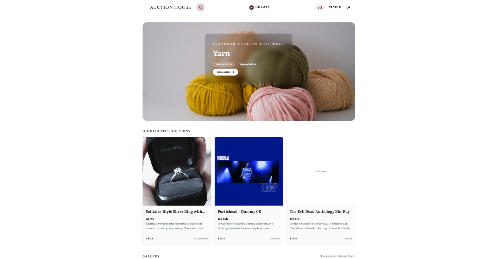

# Semester Project 2

## Auction House



Auction House is an auction platform built with HTML, Tailwind CSS, and JavaScript. Users can browse auction listings, search for items, place bids, and manage their own listings and profiles.

## Project Background

This project was originally developed for Semester Project 2 at Noroff. The project was later revisited as part of Portfolio 2, where I reviewed the existing functionality, accessibility, and overall user experience.

The focus was on improving navigation, user feedback, keyboard accessibility, visual presentation, and cleaning up unnecessary console logging.

## Features

- Browse active auction listings
- Search for auction listings
- Register and log in
- Create, edit, and delete owned listings
- Place bids on active auctions
- View auction details and bidding history
- View and manage user profiles
- Responsive design
- Conditional navigation based on authentication state

The project focuses on integrating authentication, API communication, dynamic rendering, and conditional UI logic into one complete frontend system.

## Tech Stack

- HTML
- Tailwind CSS
- JavaScript
- Noroff Auction API (v2)
- Cloudinary (image uploads)

## Portfolio 2 Improvements

As part of Portfolio 2, I revisited the project and made improvements based on reviewing the application and testing existing functionality.

Some improvements include:

- Improved the accessibility with clearer ARIA labels and mobile menu states.
- Added a close button to the search modal and improved focus handling when closing it.
- Fixed an issue where bid confirmation messages disappeared after the listing was updated.
- Added temporary bid success feedback and accessible status messages.
- Improved hover and keyboard focus styling on auction cards.
- Added more descriptive auction countdown text for screen readers.
- Fixed text contrast in the bidding section.
- Updated page titles, metadata, and favicons.
- Improved image gallery accessibility by updating the selected thumbnail's ARIA state.
- Removed unnecessary console logging in selected parts of the application.

## API

This project uses the Noroff Auction API (v2)

## Installation

1. Clone the repository

```bash
git clone https://github.com/emmelinlarina/semester-project-2.git
```

2. Navigate into the project folder

```bash
cd semester-project-2
```

3. Install dependencies

```bash
npm install
```

4. Start Tailwind in watch mode

```bash
npm run dev
```

5. Open index.html using Live Server

## Authentication

- Users can register with a valid Noroff student email
- Login returns a token stored in localStorage
- Protected routes require a valid Bearer token
- Navigation and interface elements change depending on authentication state

## Dummy Account

The following account is provided for testing purposes

```bash
Email: bingi@stud.noroff.no

Password: Bingi123
```

## Project Structure

The project is structured to separate concerns:

- `api/` API communication logic
- `utils/` – Helper functions (authentication, storage, navigation)
- `render/` – Template rendering logic
- `css/` – Compiled Tailwind output
- `src/` – Tailwind input files

This structure helps improve maintainability and readability.

## Known Limitations

- Some functions could be further refactored for readability
- The design is intentionally minimal, with focus placed on functionality
- Additional UI polish and component abstraction could improve scalability

## Deployment

The project is deployed using GitHub Pages.

## Live Site - GitHub Pages

https://emmelinlarina.github.io/semester-project-2/

## GitHub Repository

https://github.com/emmelinlarina/semester-project-2

## AI Usage

AI tools were used as learning and development support.
See [AI_LOG.md](AI_LOG.md) for further details.

## Author

Emmelin Larina Tvedt Nilsen
